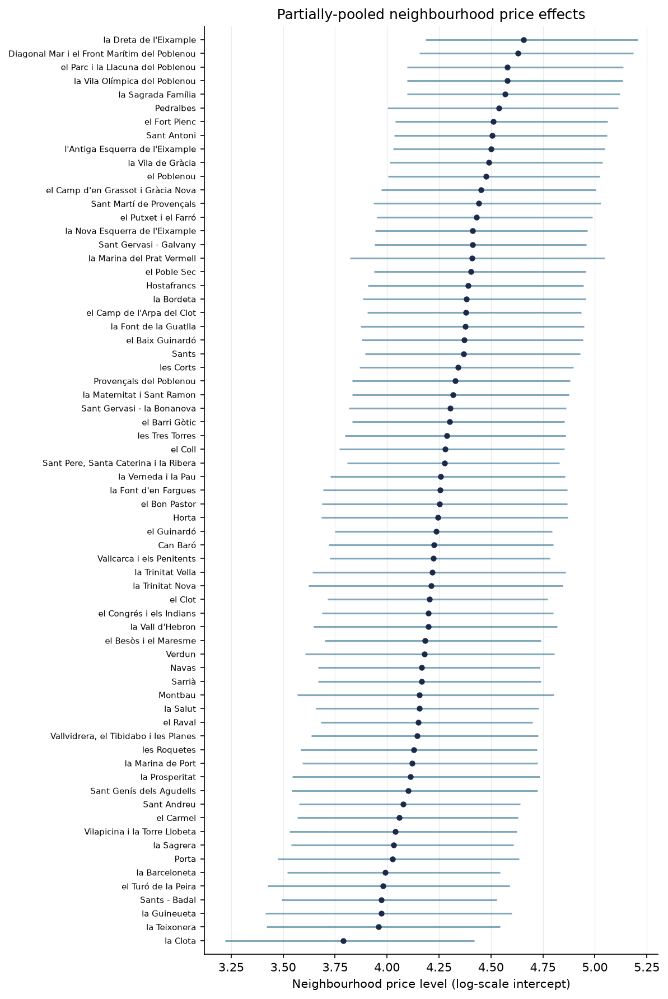
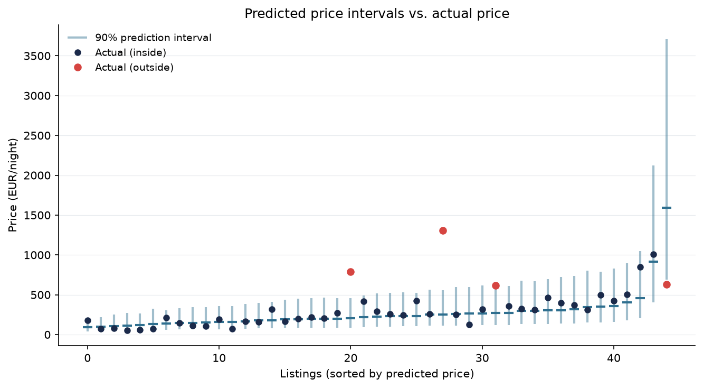
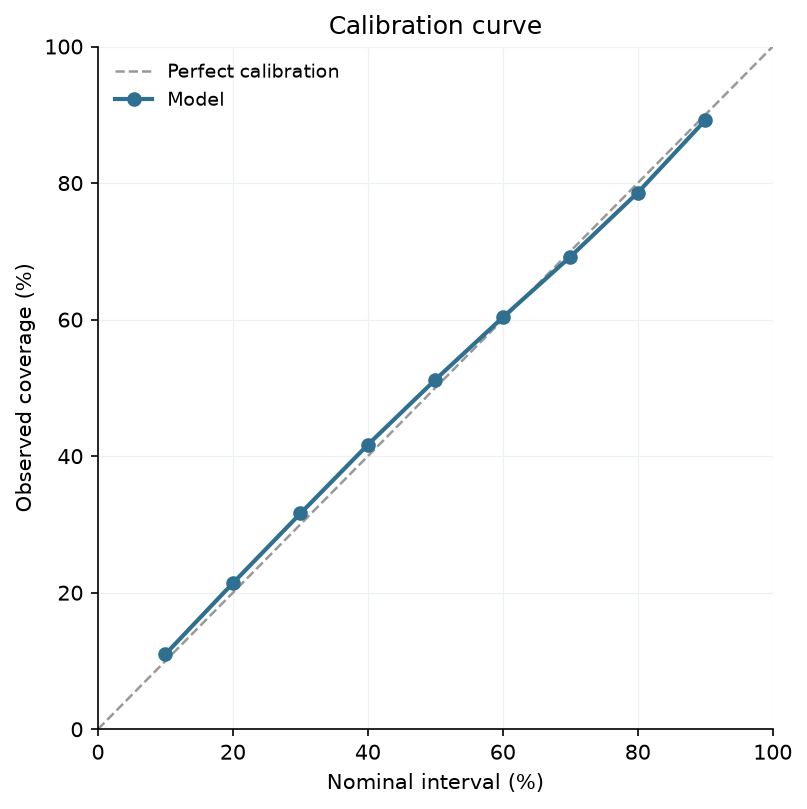

# Bayesian Airbnb Price Model — Barcelona

**Predict an Airbnb listing's price as a full probability distribution, using a hierarchical Bayesian model that pools information across neighbourhoods.**

Most price models output a single number ("this listing is worth €120"). That number is almost always a bit wrong, and it says nothing about *how* wrong. This project models the **full distribution** of a listing's fair price, so you can answer the questions a host or platform actually has: *what's a credible price range for this listing, and which listings look under-priced?*



The figure above is the heart of the model: each row is a Barcelona neighbourhood's estimated price level with its credible interval, sorted cheapest to priciest. Neighbourhoods with few listings get wider intervals and are pulled toward the city average — that's **partial pooling** at work.

---

## Results

On held-out listings, the model delivers:

| Metric | Value | What it means |
|---|---|---|
| 90% interval coverage | 89.1% | When the model gives a 90% price range, the true price falls inside ~90% of the time — the uncertainty is honest |
| 50% interval coverage | 51.1% | Well-calibrated at the middle too |
| WAPE (mean prediction) | 36% | Weighted error of the point prediction — reasonable given listing-level price is inherently noisy |
| Under-priced listings flagged | ~23% | Listings below their predicted 25th-percentile fair price, by ~€48/night on average |

### The intervals are honest, not just the point estimate

The whole point of a Bayesian model is that it returns a **distribution**, not a single number. The two plots below back up the coverage figures in the table above.



*Each listing's 90% prediction interval (blue) against its actual price. Most actual prices fall inside their interval; the few that don't (red) are high-priced listings, where uncertainty is naturally larger.*



*Observed coverage vs. nominal interval at every confidence level. The model sits almost exactly on the diagonal — it is well-calibrated across the whole range, not just at 90%.*

The model also recovers **interpretable, sensible effects**: bigger listings cost more (each extra guest capacity adds a percentage bump), entire homes command more than private rooms, which command more than shared rooms, and there's a clear neighbourhood price gradient — tourist-central areas (near la Sagrada Família, the waterfront) sit well above the city average.

**A concrete business use:** listings priced below the 25th percentile of their predicted fair price are flagged as potentially under-priced — candidates for a price increase (host revenue) or genuine bargains (guest value).

---

## Approach

A **hierarchical Bayesian regression** built in PyMC, modelling log-price:

```
log(price) ~ Normal(mu, sigma)
mu = a[neighbourhood] + b_room[room_type]
     + beta_accom·accommodates + beta_bed·bedrooms + beta_bath·bathrooms

# the hierarchy — the core of the model:
a[j] ~ Normal(mu_a, sigma_a)     # each neighbourhood drawn from a city-wide distribution
```

**Why hierarchical?** Barcelona has ~67 neighbourhoods, some with thousands of listings and some with only a handful. Treating each as an independent intercept would overfit the sparse ones; ignoring neighbourhoods entirely would throw away real location signal. Partial pooling shrinks noisy small-neighbourhood estimates toward the city mean while letting data-rich neighbourhoods speak for themselves.

**Why log-price?** Price is right-skewed and its drivers are multiplicative (a room type is proportionally cheaper, not a flat discount). Modelling log-price makes the Normal likelihood appropriate, turns coefficients into interpretable percentage effects, and stabilises the variance.

**Technical notes:** the neighbourhood intercepts use a **non-centered parameterization** (the standard fix for the funnel-shaped posterior hierarchical models create), and the model is built in three passes — pooled → + predictors → + hierarchy — checking convergence (`r_hat ≈ 1.00`) at each step. This is all narrated in the notebook.

---

## The workflow

The full analysis lives in [`bayesian_price_model.ipynb`](bayesian_price_model.ipynb), narrated step by step:

1. **Clean** — parse the messy `$1,234.00` price strings, trim the top 1% (typical-listing focus, not luxury), drop missing values.
2. **Explore** — confirm log-price is symmetric; check how price relates to room type, neighbourhood, size, and distance to centre.
3. **Engineer & encode** — log-price target, group indices for neighbourhood and room type.
4. **Model** — the three-pass hierarchical build above.
5. **Evaluate** — interval calibration, WAPE, and the under-pricing signal.
6. **Visualise** — the neighbourhood forest plot.

## Honest limitations

- The exploratory neighbourhood boxplot shows *marginal* price differences; the model separates location from size and room type, but doesn't yet model interactions (e.g. luxury entire-homes specifically).
- Predictions are for *typical* listings — the top 1% of prices were trimmed, so the luxury segment isn't covered.
- A `distance_to_centre` feature was explored but added little once neighbourhoods were included (they already encode location), so it was left out of the final model.

## Next steps

- A nested hierarchy (neighbourhood within district) to exploit Barcelona's two-level geography.
- Feature interactions (room type × size).
- Validation on a second city to test generalisation.

---

## Run it

```bash
pip install -r requirements.txt
# download a city's detailed listings.csv from http://insideairbnb.com/get-the-data/
# place it next to the notebook, then run all cells
jupyter notebook bayesian_price_model.ipynb
```

## Data

[Inside Airbnb](http://insideairbnb.com/get-the-data/) — Barcelona, detailed `listings.csv` (CC0). Not redistributed here; download it from the source.

---

*Built as a portfolio project applying Bayesian inference and uncertainty quantification — methods from my research background in computational astrophysics — to a business prediction problem.*
